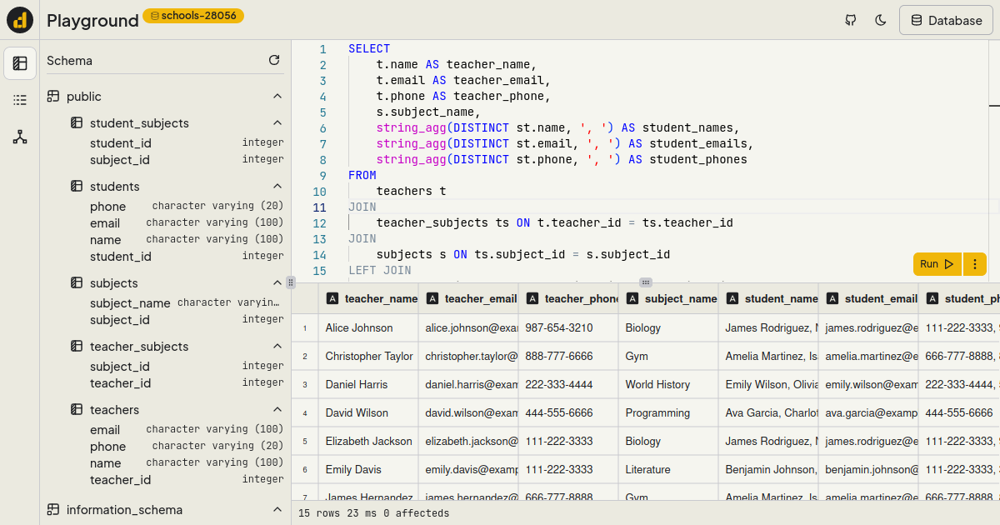

# PostgreSQL Playground

This app is client side apps (no server or login required) powered by [PGLite](https://github.com/electric-sql/pglite), a wasm port of postgreSQL. All processing is done in the browser and persistent data saved in indexedDB, so your data stays private. you can use this project as learning tools for postgreSQL without worrying about data and setup the DB.

## Features

- [x] Query Playground
- [x] ERD Schema generator
- [x] Query History
- [x] Mobile Responsiveness
- [x] Persistent Data
- [x] Export query result
- [ ] Import From File
